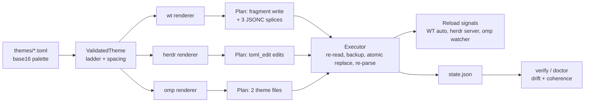

# Architecture

## Shape

One canonical palette per theme, three renderers, three write strategies, one verification loop.<br>



Rendering is a pure function from a validated theme to a plan of file edits; the executor is the only code that touches a filesystem or spawns a process.<br>
`--dry-run` prints the plan that the executor would apply.<br>
Paths come from `LOCALAPPDATA` and `APPDATA`, resolved once per invocation, so a missing environment variable is reported the same way for every command.<br>

## Target contracts

Verified on the development machine: Windows Terminal 1.24.11911, Herdr 0.9.1-preview, omp 18.3.2.<br>

| Target | File | Owned values | Reload | Validator |
| --- | --- | --- | --- | --- |
| wt | `%LOCALAPPDATA%\Microsoft\Windows Terminal\Fragments\onecoat\schemes.json` | `schemes[]` for both slots | Windows Terminal reloads when its settings file changes, re-reading fragments | vendored `profiles.schema.json` |
| wt | `%LOCALAPPDATA%\Packages\Microsoft.WindowsTerminal_8wekyb3d8bbwe\LocalState\settings.json` | root `theme` (light/dark pair), root `themes[]`, `profiles.defaults.colorScheme` (pair), optionally per-profile `colorScheme` | same | same |
| herdr | `%APPDATA%\herdr\config.toml` | `[theme]` `name`, `auto_switch`, `dark_name`, `light_name`; `[theme.custom]` and its `.dark`/`.light` layers | `herdr server reload-config` | `herdr config check` |
| omp | `<agent dir>/themes/onecoat-dark.json`, `onecoat-light.json` | every required token | file watcher on the active theme file | vendored token list |
| omp | `<agent dir>/config.yml` | `theme.dark`, `theme.light` | next launch (values are set once) | `omp config get theme.dark` |

Constraints that shape the writers:<br>

- Fragments accept only `profiles`, `schemes`, and `defaultProfile`, so window themes and both root keys must be spliced into `settings.json`.
- `theme` names may not be `light`, `dark`, or `system`.
- Herdr resolves themes from the client's local config, so the file above is correct for local use and wrong for a remote client; remote is out of scope.
- omp built-in themes take precedence over same-named custom files, hence the `onecoat-` prefix.
- omp's agent directory moves with `PI_CODING_AGENT_DIR`.

## Layout

```
src/main.rs          clap surface, exit codes, diagnostics
src/model/           ThemeId, HexColor, Slot, Target, Appearance; theme parsing
src/validate.rs      Parsed -> Validated: completeness, luminance, spacing
src/rolemap.rs       base16 role derivation shared by all renderers
src/render/wt.rs     scheme + window theme + JSONC edit plan
src/render/herdr.rs  toml_edit edit plan
src/render/omp.rs    66-token theme file plan
src/plan.rs          Plan, PlannedWrite, dry-run rendering
src/exec.rs          re-read, backup, atomic replace, re-parse, restore
src/jsonc.rs         tokenizer and byte-range splice for JSONC
src/state.rs         config, state, drift re-derivation
src/coherence.rs     role equality and perceptual spacing
src/appearance.rs    registry read + notification
src/targets.rs       path resolution, binary/socket discovery
src/error.rs         the error enum and the R-42 message contract
src/themes.rs        bundled registry, load and shadowing
themes/nord.toml     the bundled theme source
tests/fixtures/      vendored Windows Terminal schema and theme fixtures
```

## Types

Domain values are newtypes so a color cannot reach a writer unparsed:<br>

```rust
struct ThemeId(String);      // validated: lowercase, [a-z0-9-], no built-in collision
struct HexColor { r: u8, g: u8, b: u8 }   // parsed at the boundary; AlphaColor for #rrggbbaa
enum Slot { Dark, Light }
enum Target { Wt, Herdr, Omp }
enum Appearance { Dark, Light }
```

Phases are distinct types, and rendering is only reachable from a validated theme:<br>

```rust
Theme<Parsed> -> validate(&self) -> Theme<Validated>
Theme<Validated> -> Target::render(&self, slot) -> Artifact<Slot>
Artifact -> plan(&self, ctx) -> Plan -> exec(plan) -> Report
```

Errors are one enum, each variant carrying the file and key needed to act on it:<br>

```rust
enum Error {
    ThemeNotFound { id: ThemeId },
    ThemeInvalid { path: PathBuf, source: ThemeSchemaError },
    PaletteIncomplete { missing: Vec<Token> },
    AppearanceMismatch { background: HexColor, declared: Appearance },
    ReservedId { id: ThemeId, reason: ReservedReason },
    FileUnreadable { path: PathBuf, source: io::Error },
    FileUnparseable { target: Target, path: PathBuf, line: Option<u32> },
    KeyNotLocatable { path: PathBuf, key: Key },
    ExternalCheckFailed { target: Target, output: String },
    ApplyNotVerified { path: PathBuf, source: Box<Error> },
    Drift { target: Target, keys: Vec<Key> },
    Incoherent { pairs: Vec<RoleMismatch> },
}
```

## Theme schema

```toml
id = "nord"
name = "Nord"
appearance = "dark"
derived = false

[palette]                 # base16 semantics
base00 = "#0B1018"        # default background
base01 = "#151B26"        # lighter background (raised surfaces)
base02 = "#1D232D"        # selection background
base03 = "#4C566A"        # comments, invisibles
base04 = "#A0A2A8"        # dark foreground
base05 = "#DADBDD"        # default foreground
base06 = "#E5E9F0"        # light foreground
base07 = "#ECEFF4"        # light background
base08 = "#BF616A"        # variables, errors, red
base09 = "#D08770"        # integers, orange
base0A = "#EBCB8B"        # classes, yellow
base0B = "#A3BE8C"        # strings, green
base0C = "#8FBCBB"        # support, cyan
base0D = "#81A1C1"        # functions, blue
base0E = "#B48EAD"        # keywords, magenta
base0F = "#BF616A"        # deprecated, brown

[ansi]                    # optional; keys are Windows Terminal's scheme keys, so the magenta role is spelled `purple`/`brightPurple`

[targets.wt]              # optional; keys are `background`, `foreground`, `cursorColor`, `selectionBackground`
cursorColor = "#D8DEE9"

[targets.herdr]           # optional; "terminal" makes panes inherit the host ANSI palette
name = "terminal"

[targets.omp]             # optional
mdHeading = "#81A1C1"
```

Overrides are the only place target-specific color literals may appear; everything else derives from `palette` by the rules below, which is what keeps the three surfaces equal by construction.<br>

## Validation

`Theme::parse` checks the shape of a document — which keys exist and whether each holds the TOML type the schema requires — and `validate` interprets the values, so a parse error never depends on a value.<br>
`validate` runs its checks in a fixed order, so a broken file yields one predictable message: palette keys and completeness, palette colors, appearance against `base00`'s luminance, id against the omp built-ins, `[ansi]`, `[targets.wt]`, then the remaining target sections in section-name order.<br>

The theme set is the bundled themes followed by `<APPDATA>\onecoat\themes\*.toml` in file-name order:<br>

- A user theme shadows a bundled theme with the same id; two user files with one id is an error.
- A missing theme directory is an empty set, and any file that does not validate fails the whole command, so a broken theme cannot silently disappear from `list`.
- Bundled themes are compiled into the binary, so onecoat ships no data files.

## Role derivation

Base16 semantics drive every mapping; `[ansi]` and `[targets.*]` override individually.<br>
`rolemap` is the single derivation point: a renderer reads a role and never re-derives one, and overrides apply on top of the derived set.<br>

| Target | Mapping |
| --- | --- |
| wt scheme | `background`=00, `foreground`=05, `cursorColor`=0D, `selectionBackground`=02; `black`=00, `red`=08, `green`=0B, `yellow`=0A, `blue`=0D, `magenta`=0E, `cyan`=0C, `white`=06; brights from 03 and 07 |
| wt window | `window.applicationTheme`=slot, `frame`/`tabRow.unfocusedBackground`=00, `tabRow.background`/`tab.background`=01, `tab.unfocusedBackground`=00 |
| herdr | `panel_bg`=00, `sidebar_bg`=01, `active_row_bg`=02, `selection_bg`=02, `text`=05, `accent`=0D, `red`=08, `green`=0B, `blue`=0D, `yellow`=0A; `name = "terminal"` inherits ANSI for everything else |
| omp text | `text`=05, `muted`=04, `dim`=03, `accent`=0D, `border`=02, `borderMuted`=01, `borderAccent`=0D, `success`=0B, `error`=08, `warning`=0A |
| omp blocks | `toolPendingBg`=00, `userMessageBg`=01, `toolSuccessBg`=01, `toolErrorBg`=01, `customMessageBg`=02, `selectedBg`=02, `statusLineBg`=02 |
| omp syntax | comment=03, keyword=0E, function=0D, variable=08, string=0B, number=09, type=0A, operator=0C, punctuation=05 |
| omp markdown | heading=0D, link=0D, linkUrl=0C, code=0B, codeBlock=05, quote=0C, hr=03, bullet=0D |
| omp diff | added=0B, removed=08, context=03 |
| omp thinking | off=03, minimal=04, low=0D, medium=0C, high=0C, xhigh=0A, max=08 |
| omp status line | sep=01, model=0D, path=0C, gitClean=0B, gitDirty=0A, context=0C, spend=05, staged=0B, dirty=0A, untracked=08, output=04, cost=0E, subagents=0E |

The table is the contract; the exhaustive token list for omp lives beside it in `src/render/omp.rs` and is checked for completeness by a test, so a new harness token fails the build rather than rendering as a default.<br>

## Writers

All three writers share one discipline: build a plan from pure data, then execute it.<br>

- wt fragment: fully generated JSON, so a plain serializer is safe; written only when its bytes change.
- wt settings: locate the byte range of the value owned for each of `theme`, `themes`, and `profiles.defaults.colorScheme`. Replace that range in place, or insert a new key into the root object with the file's own indentation and comma style. Comments, key order, and unrelated whitespace are never touched. Indentation, line endings, and trailing-newline state are detected from the file and reproduced.
- herdr: `toml_edit` navigates to `theme`, sets owned values, and creates missing tables; its decoration model preserves comments and blank lines. The result is validated by `herdr config check` before the temp file replaces the original.
- omp: both slot files are generated wholesale, so no preservation logic is needed; `config.yml` is edited only when a pinned name differs from the current value.

Execution per file: re-read, re-plan against the fresh bytes, write the temporary file, back up the original, replace, re-parse the result, and restore the backup if the parse fails.<br>
The plan is ordered, and the executor stops at the first failure: there is no rollback, so a failed write leaves no backup and the files already written stay written.<br>
Unchanged plans skip the write entirely, which keeps mtimes and watchers quiet.<br>

State is written last: `%APPDATA%\onecoat\state.json` holds the slot assignment, the pinned target names, and the expected value for every owned key.<br>
It is disposable — deleting it turns the next `verify` into a full re-derivation instead of a comparison.<br>

## Drift and coherence

`verify` re-derives every owned value from the canonical theme and compares it against the parsed target file.<br>
A reformatted file is not drift; a changed color is.<br>
Files that fail to parse are reported as errors, not drift.<br>

Coherence has two independent checks:<br>

- Cross-target equality: role equivalence is guaranteed by construction, so `verify` is asserting the writer did not lie — `base00` reaches the terminal background, herdr panel, and omp tool frame identically.
- Palette spacing: `validate` measures ΔE00 between `base00`, `base01`, and `base02`. Below 2.0 the layers are indistinguishable and the theme is rejected under `--strict`; above 8.0 the surface reads as a separate panel rather than the same surface raised.

## Appearance automation

Windows appearance comes from `HKCU\Software\Microsoft\Windows\CurrentVersion\Themes\Personalize` value `AppsUseLightTheme`.<br>
`watch` blocks on `RegNotifyChangeKeyValue` for that key and applies the matching slot on change; there is no polling loop and no resident process when `watch` is not running.<br>

Once applied, each target switches appearance on its own: Windows Terminal through `theme` and `colorScheme` pairs, Herdr through `auto_switch` plus its per-appearance override layers, and omp through its dark/light slots.<br>
`watch` therefore matters mainly for theme switches, not for ordinary day/night flipping.<br>

## Import

Import targets the strongest available guarantee per source rather than a uniform round trip:<br>

| Source | Guarantee |
| --- | --- |
| base16 file | palette is exact; all other targets derive |
| omp theme JSON | invertible tokens fill the palette, the rest become `[targets.omp]` overrides; the omp artifact re-renders exactly |
| Windows Terminal scheme | `[ansi]` and `[targets.wt]` take the scheme's values, the palette is derived best-effort, and the theme is marked `derived` |

The regression bar for import is a re-render test: import a fixture, apply it, and assert the imported target's values match the source.<br>

## Testing

- Fixtures are real files: a commented `settings.json` with a pinned-profile case and a real herdr `config.toml` with its comments intact.
- Golden tests snapshot whole files and assert the number of changed hunks equals the number of owned keys, so an unintended rewrite fails loudly.
- Every writer test is paired with an idempotency test: apply twice, assert byte equality and that the second run performed no writes.
- Herdr output is validated by spawning `herdr config check` with `APPDATA` pointed at a fixture directory.
- Windows Terminal output is validated against a vendored, version-pinned `profiles.schema.json`.
- omp output is checked for token completeness and, in the smoke test, by launching `omp` under an isolated profile and asserting no theme error.
- The end-to-end smoke test runs the release binary against the real machine: apply, verify, then restore from backups and assert the restore is byte-identical.

## Decisions of record

- Rust with `toml_edit` for the Herdr config, `jsonc-parser` plus a byte-range splice for Windows Terminal, and `serde_json` for generated files.
- One canonical palette, per-target overrides only for values base16 cannot express.
- Stable target names and both appearance slots written once, so switching a theme rewrites content instead of configuration.
- Fragments own scheme data; `settings.json` owns only the three keys fragments cannot carry.
- Drift is semantic, never byte-based.
- onecoat never restarts a client; it reloads only what has a documented reload signal.
- Windows-only for v1, with pure renderers so the other targets' platforms stay reachable.

Milestones live in [`roadmap.md`](./roadmap.md).<br>
